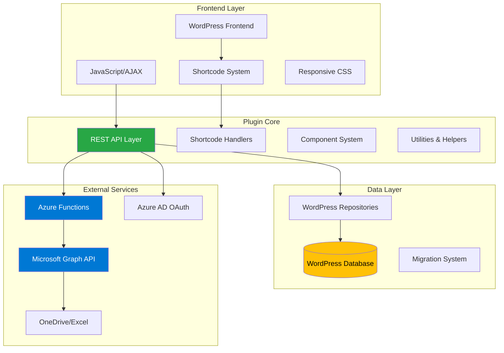

# System Architecture Overview

Tiger Grades employs a sophisticated **multi-layered architecture** that combines WordPress plugin development best practices with modern cloud integration patterns. This document provides a comprehensive overview of the system design, data flow, and technical implementation.

## 🏗️ High-Level Architecture



## 🔧 Core Components

### 1. **Plugin Bootstrap** (`src/tiger-grades.php`)

The main plugin file orchestrates the entire system initialization:

```php
// Define plugin constants
define('TIGER_GRADES_PATH', plugin_dir_path(__FILE__));
define('TIGER_GRADES_URL', plugin_dir_url(__FILE__));

// Autoload all components
require_once TIGER_GRADES_PATH . 'includes/repositories/DatabaseManager.php';
require_once TIGER_GRADES_PATH . 'includes/api/TigerGradesAPI.php';
// ... additional includes

// Register activation hooks
register_activation_hook(__FILE__, function() {
    StringTranslationsManager::registerTranslations();
});
```

**Key Responsibilities:**
- Environment setup and constant definition
- Component dependency loading
- WordPress hook registration
- Plugin lifecycle management

### 2. **API Layer Architecture**

Tiger Grades implements a **robust REST API** with three specialized controllers:

#### **TigerGradesAPI** - Core Data Operations
```php
class TigerGradesAPI {
    private $graph_api_auth_service;
    private $classRepository;
    private $httpService;
    
    public function fetchReportCard($user_id, $enrollment_id, $sort_by, $type, $is_teacher) {
        // Microsoft Graph API integration
        $access_token = $this->graph_api_auth_service->getToken();
        $data = $this->httpService->getJson($url, $headers);
        
        // Data processing and formatting
        return $this->createReportCardObject($student_data, ...);
    }
}
```

**Endpoints:**
- `GET /wp-json/tiger-grades/v1/report-card` - Grade data retrieval
- `GET /wp-json/tiger-grades/v1/class-metadata` - Class information
- `GET /wp-json/tiger-grades/v1/students` - Student list for teachers

#### **TeachersAPI** - Educator Operations
```php
class TeachersAPI {
    public function handle_create_class_request($request) {
        // Validate and create class in database
        $data = $this->classRepository->createClass(...);
        
        // Trigger Azure microservice for gradebook creation
        $microservice_response = $this->call_class_registration_microservice(...);
        
        return new WP_REST_Response($response, 200);
    }
}
```

**Endpoints:**
- `POST /wp-json/tiger-grades/v1/create-class` - Class creation
- `POST /wp-json/tiger-grades/v1/create-enrollment` - Student enrollment
- `POST /wp-json/tiger-grades/v1/approve-enrollment` - Enrollment approval
- `POST /wp-json/tiger-grades/v1/update-class` - Azure callback endpoint

#### **GeneralAPI** - Utility Operations
```php
class GeneralAPI {
    public function appendShortcodeWithUTF8Support(DOMDocument $dom, DOMElement $container, string $shortcode): void {
        // Advanced UTF-8 handling for multilingual content
        $nodes = $this->renderShortcodeWithUTF8Support($dom, $shortcode);
        foreach ($nodes as $node) {
            $container->appendChild($node);
        }
    }
}
```

## 🗄️ Database Schema Design

### **Core Tables Overview**

```sql
-- Main class management
CREATE TABLE `wp_tigr_classes` (
  `id` bigint(19) UNSIGNED NOT NULL AUTO_INCREMENT,
  `teacher` bigint(19) UNSIGNED NOT NULL,
  `title` varchar(45) NOT NULL,
  `gradebook_id` varchar(45) DEFAULT NULL,
  `status` varchar(45) NOT NULL DEFAULT 'pending',
  `enrollment_code` varchar(6) DEFAULT NULL,
  `type` bigint(19) UNSIGNED NOT NULL,
  `description` varchar(255) NOT NULL,
  `start_date` datetime NOT NULL,
  `end_date` datetime NOT NULL,
  PRIMARY KEY (`id`),
  CONSTRAINT `wp_users_ID_teacher` FOREIGN KEY (`teacher`) REFERENCES `wp_users` (`ID`)
);

-- Student enrollment tracking
CREATE TABLE `wp_tigr_enrollments` (
  `id` bigint(19) UNSIGNED NOT NULL AUTO_INCREMENT,
  `class_id` bigint(19) UNSIGNED NOT NULL,
  `user_id` bigint(19) UNSIGNED NOT NULL,
  `student_name` varchar(45) NOT NULL,
  `status` varchar(45) NOT NULL DEFAULT 'pending',
  `student_id` int(11) DEFAULT NULL,
  PRIMARY KEY (`id`),
  CONSTRAINT `wp_tigr_classes_id` FOREIGN KEY (`class_id`) REFERENCES `wp_tigr_classes` (`id`)
);
```

### **Automated Triggers**

```sql
-- Auto-activate classes when gradebook is created
CREATE TRIGGER `wp_tigr_classes_BEFORE_UPDATE` BEFORE UPDATE ON `wp_tigr_classes` 
FOR EACH ROW BEGIN
    IF NEW.gradebook_id IS NOT NULL THEN
        SET NEW.status = 'active';
    END IF;
    SET NEW.updated = CURRENT_TIMESTAMP;
END;

-- Auto-approve enrollments when student is assigned
CREATE TRIGGER `wp_tigr_enrollments_BEFORE_UPDATE` BEFORE UPDATE ON `wp_tigr_enrollments` 
FOR EACH ROW BEGIN
    IF NEW.student_id IS NOT NULL THEN
        SET NEW.status = 'approved';
    END IF;
    SET NEW.updated = CURRENT_TIMESTAMP;
END;
```

## ☁️ Microsoft Integration Architecture

### **Authentication Flow**

```php
class MicrosoftAuthService {
    public function getAccessToken($scope = 'https://graph.microsoft.com/.default') {
        // OAuth 2.0 Client Credentials Flow
        $postData = http_build_query([
            'client_id' => $this->msft_client_id,
            'scope' => $scope,
            'client_secret' => $this->msft_client_secret,
            'grant_type' => 'client_credentials'
        ]);
        
        $response = $this->http_service->makeHttpRequest($url, 'POST', $headers, $postData);
        $this->jwt_token_manager->store_token($data->access_token, $data->expires_in);
    }
}
```

### **Azure Functions Integration**

The system leverages **Azure Functions** for serverless gradebook creation:

```php
private function call_class_registration_microservice($teachers_folder_name, $gradebook_name, $email, $class_id) {
    $url = getenv("TIGER_GRADES_AZURE_FUNCTIONS_BASE_URL") . "/api/client-function";
    $body = [
        'function_name' => 'class-registration-orchestrator',
        'data' => [
            'teacher_name' => $teachers_folder_name,
            'gradebook_name' => $gradebook_name,
            'email' => $email,
            'class_id' => $class_id
        ]
    ];
    
    return $this->httpService->postJson($url, $headers, $body);
}
```

**Azure Orchestration Flow:**
1. **Trigger**: Teacher creates class in WordPress
2. **Authentication**: Service acquires access token
3. **Folder Creation**: Azure creates teacher's OneDrive folder
4. **Template Copy**: Excel gradebook template is copied
5. **Customization**: Template is populated with class data
6. **Callback**: Azure notifies WordPress with gradebook ID

## 🎨 Frontend Architecture

### **Shortcode System**

Tiger Grades uses a **component-based shortcode architecture**:

```php
class ClassManagementShortcode {
    public function render($atts) {
        $dom = new DOMDocument('1.0', 'utf-8');
        $root = DOMHelper::createElement($dom, 'div', 'report-card-container');
        
        // Dynamic content generation
        $this->renderEnrollmentTable($dom, $enrollments, $table);
        
        // JavaScript integration
        wp_enqueue_script('tiger-grades-class-management', ...);
        wp_localize_script('tiger-grades-class-management', 'tigerGradesData', [
            'apiUrl' => rest_url('tiger-grades/v1/students'),
            'nonce' => wp_create_nonce('wp_rest')
        ]);
        
        return $dom->saveHTML();
    }
}
```

### **JavaScript/AJAX Architecture**

```javascript
// Real-time grade fetching
const fetchGrades = async (type, enrollmentId) => {
    const response = await fetch(`${apiUrl}?type=${type}&enrollment_id=${enrollmentId}`, {
        headers: {
            'X-WP-Nonce': nonce,
            'Content-Type': 'application/json'
        }
    });
    
    const data = await response.json();
    renderGradeTable(data);
};

// Dynamic student selection
const handleStudentSelection = (studentId) => {
    updateURL(`/grades/${classId}?student=${studentId}`);
    fetchGrades('all', enrollmentId);
};
```

## 🔐 Security Architecture

### **Multi-Layer Authentication**

1. **WordPress Session Layer**: Standard WordPress user authentication
2. **REST API Nonces**: CSRF protection for AJAX requests
3. **JWT Token Management**: Secure Microsoft Graph API access
4. **Role-Based Permissions**: Granular access control

```php
class SecurityManager {
    public function check_route_permission() {
        $user = wp_get_current_user();
        $required_role = $this->getRequiredRole();
        
        return is_user_logged_in() && 
               in_array($required_role, (array) $user->roles);
    }
}
```

### **Data Validation Pipeline**

```php
// Input sanitization
'title' => [
    'required' => true,
    'type' => 'string',
    'sanitize_callback' => 'sanitize_text_field',
    'validate_callback' => function($value) {
        return strlen($value) <= 45;
    }
]
```

## 📊 Performance Optimization

### **Caching Strategy**

- **JWT Token Caching**: Tokens cached until expiration
- **Database Query Optimization**: Prepared statements with proper indexing
- **Asset Optimization**: Conditional script/style loading

### **Lazy Loading**

```php
// Services instantiated only when needed
private function getAPI() {
    if (!$this->api) {
        $this->api = TigerGradesAPI::getInstance();
    }
    return $this->api;
}
```

## 🌐 Internationalization

Tiger Grades supports **comprehensive multilingual functionality**:

```php
class LanguageManager {
    public function registerRestApiLanguageDetection($namespace) {
        add_filter('rest_authentication_errors', function($result) {
            if (strpos($_SERVER['REQUEST_URI'], "/{$namespace}/") !== false) {
                $this->setLanguageFromRequest();
            }
            return $result;
        });
    }
}
```

## 🚀 Deployment Architecture

### **Migration System**

```php
class DatabaseManager {
    public static function executeSQLScript($scriptPath, $type = 'query') {
        // Execute migration files
        $sql = file_get_contents($scriptPath);
        $sql = self::processVariables($sql);
        
        if ($type === 'query') {
            return $wpdb->query($sql);
        }
        
        return dbDelta($sql);
    }
}
```

### **CI/CD Integration**

The system includes **GitHub Actions** for automated deployment:

```yaml
- name: Run migrations
  script: |
    for migration in ./migrations/*.sql; do
      migration_name="${migration##*/}"
      applied=$(wp db query "SELECT COUNT(*) FROM wp_tigr_migrations WHERE name='$migration_name'")
      
      if [ "$applied" -eq "0" ]; then
        wp db query < "$migration"
        wp db query "INSERT INTO wp_tigr_migrations (name) VALUES ('$migration_name')"
      fi
    done
```

## 🔄 Data Flow Architecture

### **Grade Synchronization Pipeline**

1. **Teacher Input**: Grades entered in Excel/OneDrive
2. **Graph API Polling**: WordPress fetches updated data
3. **Data Processing**: Raw Excel data transformed to report objects
4. **Cache Update**: Processed data cached for performance
5. **Frontend Delivery**: Data served to parents/students via API

### **Real-Time Updates**

```javascript
// WebSocket-style polling for status updates
const pollClassStatus = (classId) => {
    const interval = setInterval(async () => {
        const status = await fetchClassStatus(classId);
        if (status === 'active') {
            clearInterval(interval);
            showSuccessMessage('Class is now active!');
            refreshClassList();
        }
    }, 5000);
};
```

This architecture provides **enterprise-grade scalability**, **robust security**, and **seamless user experience** while maintaining the flexibility and extensibility that WordPress developers expect. 