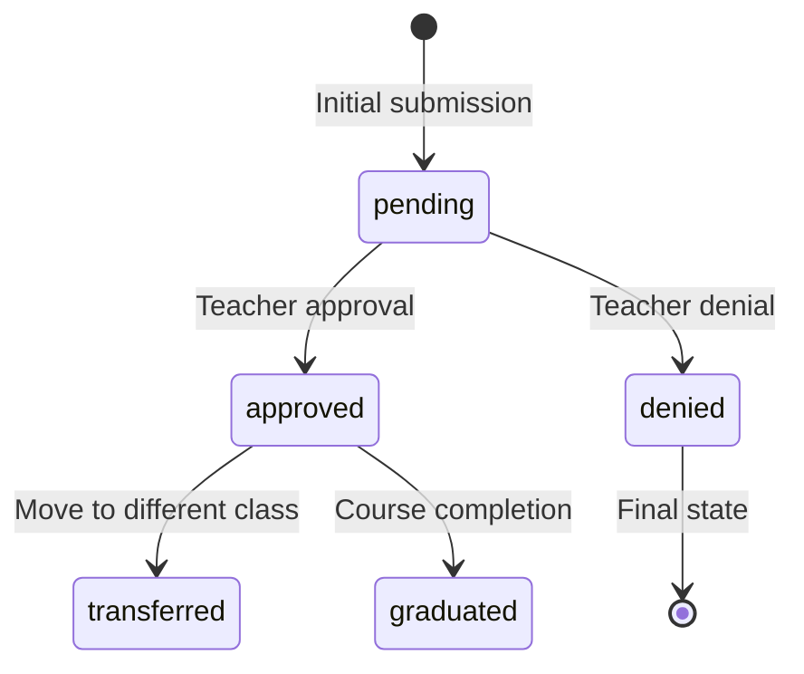
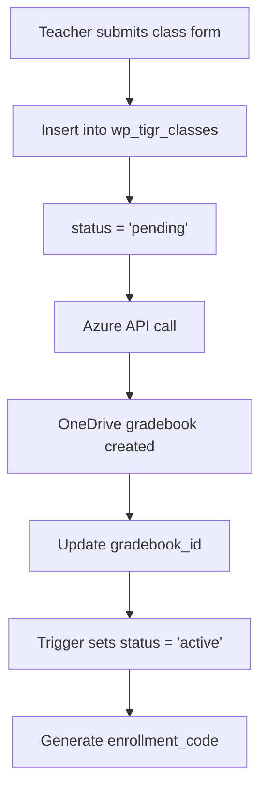
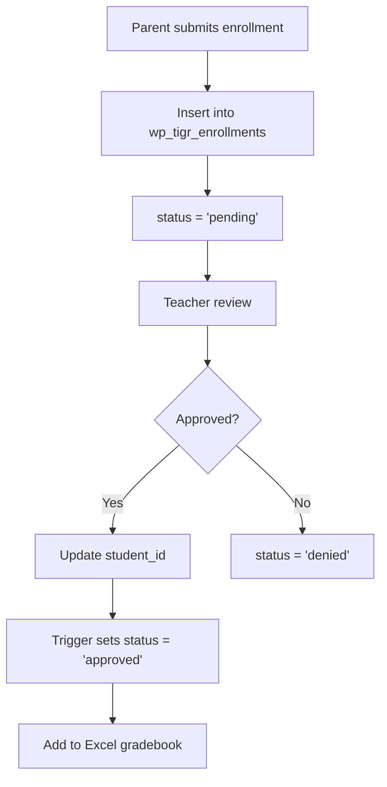
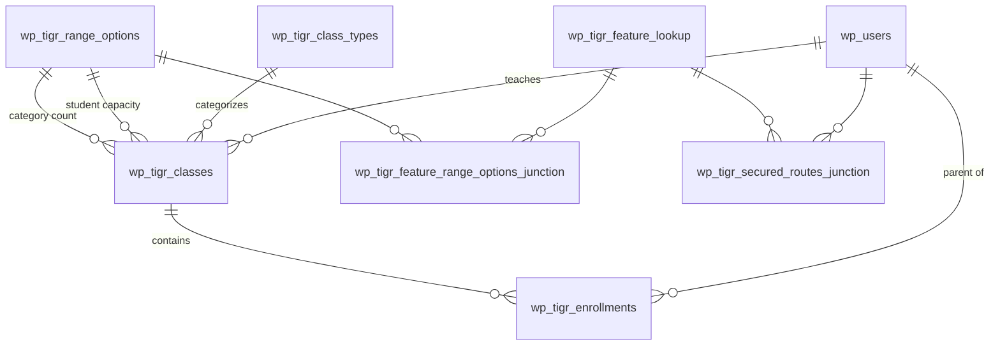

# Database Schema 🗄️

Tiger Grades utilizes a carefully designed MySQL database schema that seamlessly integrates with WordPress while providing specialized functionality for educational management. This documentation covers all custom tables, relationships, and data flow patterns.

## 🎯 Schema Overview

The Tiger Grades database extends WordPress with custom tables for:

- **Class Management** - Course creation and organization
- **Enrollment System** - Student-teacher-parent relationships  
- **Feature Control** - Granular permission management
- **Configuration Management** - Flexible system settings
- **Audit & Security** - Comprehensive activity tracking

## 📊 Core Tables

### Classes Table (`wp_tigr_classes`)

The central table for all class-related information:

```sql
CREATE TABLE `wp_tigr_classes` (
  `id` bigint(19) UNSIGNED NOT NULL AUTO_INCREMENT,
  `teacher` bigint(19) UNSIGNED NOT NULL,
  `title` varchar(45) NOT NULL,
  `gradebook_id` varchar(45) DEFAULT NULL,
  `status` varchar(45) NOT NULL DEFAULT 'pending',
  `enrollment_code` varchar(6) DEFAULT NULL,
  `created` datetime NOT NULL DEFAULT current_timestamp(),
  `updated` datetime NOT NULL DEFAULT current_timestamp(),
  `gradebook_url` varchar(255) DEFAULT NULL,
  `num_students` bigint(19) UNSIGNED NOT NULL,
  `num_categories` bigint(19) UNSIGNED NOT NULL,
  `type` bigint(19) UNSIGNED NOT NULL,
  `description` varchar(255) NOT NULL,
  `message` varchar(512) DEFAULT NULL,
  `start_date` datetime NOT NULL,
  `end_date` datetime NOT NULL,
  `gradebook_file_name` varchar(128) NOT NULL,
  
  PRIMARY KEY (`id`),
  UNIQUE KEY `gradebook_id_UNIQUE` (`gradebook_id`),
  UNIQUE KEY `enrollment_code_UNIQUE` (`enrollment_code`),
  KEY `wp_users_ID_idx` (`teacher`),
  KEY `num_students_idx` (`num_students`),
  KEY `num_categories_idx` (`num_categories`),
  KEY `class_type_idx` (`type`)
) ENGINE=InnoDB DEFAULT CHARSET=utf8mb4 COLLATE=utf8mb4_unicode_ci;
```

**Field Descriptions:**

| Field | Type | Description | Constraints |
|-------|------|-------------|-------------|
| `id` | BIGINT | Primary key | AUTO_INCREMENT, UNSIGNED |
| `teacher` | BIGINT | WordPress user ID of teacher | FK to wp_users.ID |
| `title` | VARCHAR(45) | Class display name | NOT NULL |
| `gradebook_id` | VARCHAR(45) | OneDrive file ID | UNIQUE, set via Azure API |
| `status` | VARCHAR(45) | pending/active/archived | DEFAULT 'pending' |
| `enrollment_code` | VARCHAR(6) | Student enrollment code | UNIQUE, NULL until generated |
| `gradebook_url` | VARCHAR(255) | Direct OneDrive share URL | Optional |
| `num_students` | BIGINT | Estimated class size | FK to wp_tigr_range_options |
| `num_categories` | BIGINT | Grade category count | FK to wp_tigr_range_options |
| `type` | BIGINT | Subject classification | FK to wp_tigr_class_types |
| `description` | VARCHAR(255) | Class description | NOT NULL |
| `message` | VARCHAR(512) | Welcome message | Optional |
| `gradebook_file_name` | VARCHAR(128) | Excel filename | Auto-generated |

### Enrollments Table (`wp_tigr_enrollments`)

Manages student enrollments and parent-student relationships:

```sql
CREATE TABLE `wp_tigr_enrollments` (
  `id` bigint(19) UNSIGNED NOT NULL AUTO_INCREMENT,
  `class_id` bigint(19) UNSIGNED NOT NULL,
  `user_id` bigint(19) UNSIGNED NOT NULL,
  `student_name` varchar(45) NOT NULL,
  `message` varchar(100) DEFAULT NULL,
  `status` varchar(45) NOT NULL DEFAULT 'pending',
  `student_id` int(11) DEFAULT NULL,
  `created` datetime NOT NULL DEFAULT current_timestamp(),
  `updated` datetime NOT NULL DEFAULT current_timestamp(),
  
  PRIMARY KEY (`id`),
  UNIQUE KEY `id_UNIQUE` (`id`),
  KEY `wp_users_ID_idx` (`user_id`),
  KEY `wp_tigr_classes_id_idx` (`class_id`)
) ENGINE=InnoDB DEFAULT CHARSET=utf8mb4 COLLATE=utf8mb4_unicode_ci;
```

**Key Relationships:**
- `class_id` → `wp_tigr_classes.id`
- `user_id` → `wp_users.ID` (parent/guardian account)
- `student_id` → Position in Excel gradebook (set when approved)

**Status Flow:**


### Class Types Table (`wp_tigr_class_types`)

Defines available subject areas and their visual representations:

```sql
CREATE TABLE `wp_tigr_class_types` (
  `id` bigint(19) UNSIGNED NOT NULL AUTO_INCREMENT,
  `title` varchar(45) NOT NULL,
  `image` bigint(19) UNSIGNED NOT NULL,
  
  PRIMARY KEY (`id`),
  UNIQUE KEY `title_UNIQUE` (`title`),
  KEY `image_post_ID_idx` (`image`)
) ENGINE=InnoDB DEFAULT CHARSET=utf8mb4 COLLATE=utf8mb4_unicode_ci;
```

**Default Subject Types:**
```sql
INSERT INTO `wp_tigr_class_types` VALUES
(1, 'English', 1604),
(2, 'History', 1605),
(3, 'Science', 1651),
(4, 'Math', 1814),
(5, 'Foreign Language', 1820),
(6, 'Art', 1818),
(7, 'Chinese', 1819),
(8, 'PE', 1821);
```

## 🔧 Configuration & Feature Management

### Feature Lookup Table (`wp_tigr_feature_lookup`)

Hierarchical feature management system for granular permissions:

```sql
CREATE TABLE `wp_tigr_feature_lookup` (
  `id` bigint(19) UNSIGNED NOT NULL AUTO_INCREMENT,
  `title` varchar(45) NOT NULL,
  `description` varchar(255) NOT NULL,
  `status` varchar(45) NOT NULL DEFAULT 'active',
  `parent_feature` bigint(19) UNSIGNED DEFAULT NULL,
  
  PRIMARY KEY (`id`),
  KEY `parent_feature_idx` (`parent_feature`)
) ENGINE=InnoDB DEFAULT CHARSET=utf8mb4 COLLATE=utf8mb4_unicode_ci;
```

**Feature Hierarchy Example:**
```
user-registration (1)
├── teacher-registration-form (7)
class-registration-form (1)
├── num_students (2)
├── num_categories (3)
rest-api-routes (4)
├── /tiger-grades/v1/update-class (5)
```

### Range Options Table (`wp_tigr_range_options`)

Flexible configuration for numeric ranges used throughout the system:

```sql
CREATE TABLE `wp_tigr_range_options` (
  `id` bigint(19) UNSIGNED NOT NULL AUTO_INCREMENT,
  `label` varchar(45) NOT NULL,
  `min` int(11) NOT NULL DEFAULT 0,
  `max` int(11) DEFAULT NULL,
  `status` varchar(45) NOT NULL DEFAULT 'active',
  
  PRIMARY KEY (`id`)
) ENGINE=InnoDB DEFAULT CHARSET=utf8mb4 COLLATE=utf8mb4_unicode_ci;
```

**Example Range Configurations:**
| ID | Label | Min | Max | Usage |
|----|-------|-----|-----|-------|
| 1 | '100+' | 100 | NULL | Large class sizes |
| 4 | '11-30' | 11 | 30 | Medium class sizes |
| 5 | '1-10' | 1 | 10 | Small class sizes |

## 🔗 Junction Tables

### Feature Range Options Junction (`wp_tigr_feature_range_options_junction`)

Links features to their available range configurations:

```sql
CREATE TABLE `wp_tigr_feature_range_options_junction` (
  `range_option_id` bigint(19) UNSIGNED NOT NULL,
  `feature_lookup_id` bigint(19) UNSIGNED NOT NULL,
  
  KEY `range_option_id_idx` (`range_option_id`),
  KEY `feature_lookup_id_idx` (`feature_lookup_id`)
) ENGINE=InnoDB DEFAULT CHARSET=utf8mb4 COLLATE=utf8mb4_unicode_ci;
```

### Secured Routes Junction (`wp_tigr_secured_routes_junction`)

User-specific feature access control:

```sql
CREATE TABLE `wp_tigr_secured_routes_junction` (
  `user_id` bigint(20) UNSIGNED NOT NULL,
  `feature_lookup_id` bigint(20) UNSIGNED NOT NULL,
  
  KEY `user_id_idx` (`user_id`),
  KEY `feature_lookup_id_idx` (`feature_lookup_id`)
) ENGINE=InnoDB DEFAULT CHARSET=utf8mb4 COLLATE=utf8mb4_unicode_ci;
```

## ⚡ Database Triggers

### Automatic Status Management

Tiger Grades uses triggers for intelligent status updates:

```sql
-- Class status trigger
DROP TRIGGER IF EXISTS `wp_tigr_classes_BEFORE_UPDATE`;
DELIMITER $$
CREATE TRIGGER `wp_tigr_classes_BEFORE_UPDATE` 
BEFORE UPDATE ON `wp_tigr_classes` 
FOR EACH ROW 
BEGIN
    IF NEW.gradebook_id IS NOT NULL THEN
        SET NEW.status = 'active';
    END IF;
    SET NEW.updated = CURRENT_TIMESTAMP;
END$$
DELIMITER ;

-- Enrollment approval trigger  
DROP TRIGGER IF EXISTS `wp_tigr_enrollments_BEFORE_UPDATE`;
DELIMITER $$
CREATE TRIGGER `wp_tigr_enrollments_BEFORE_UPDATE` 
BEFORE UPDATE ON `wp_tigr_enrollments` 
FOR EACH ROW 
BEGIN
    IF NEW.student_id IS NOT NULL THEN
        SET NEW.status = 'approved';
    END IF;
    SET NEW.updated = CURRENT_TIMESTAMP;
END$$
DELIMITER ;
```

## 🔄 Data Flow Patterns

### Class Creation Workflow



### Enrollment Approval Process



## 🔍 Query Optimization

### Indexing Strategy

**Primary Indexes:**
- All foreign key relationships have corresponding indexes
- Unique constraints on enrollment_code and gradebook_id
- Composite indexes for common query patterns

**Query Examples:**

```sql
-- Get teacher's active classes with enrollment counts
SELECT 
    c.id,
    c.title,
    c.status,
    COUNT(e.id) as enrollment_count,
    ct.title as class_type
FROM wp_tigr_classes c
LEFT JOIN wp_tigr_enrollments e ON c.id = e.class_id AND e.status = 'approved'
LEFT JOIN wp_tigr_class_types ct ON c.type = ct.id
WHERE c.teacher = ? AND c.status = 'active'
GROUP BY c.id;

-- Get parent's children with their class information
SELECT 
    e.student_name,
    c.title as class_title,
    c.description,
    u.display_name as teacher_name,
    e.status as enrollment_status
FROM wp_tigr_enrollments e
JOIN wp_tigr_classes c ON e.class_id = c.id
JOIN wp_users u ON c.teacher = u.ID
WHERE e.user_id = ? AND e.status IN ('approved', 'pending');
```

## 🛡️ Security Considerations

### Data Protection

**Sensitive Information:**
- Enrollment codes are unique and expire automatically
- Student names are stored separately from WordPress user accounts
- Parent-student relationships are maintained through enrollments table

**Access Patterns:**
```php
// Secure class access verification
function verifyClassAccess($user_id, $class_id, $role) {
    switch ($role) {
        case 'teacher':
            return DB::table('wp_tigr_classes')
                ->where('id', $class_id)
                ->where('teacher', $user_id)
                ->exists();
                
        case 'parent':
            return DB::table('wp_tigr_enrollments')
                ->join('wp_tigr_classes', 'class_id', '=', 'wp_tigr_classes.id')
                ->where('wp_tigr_classes.id', $class_id)
                ->where('wp_tigr_enrollments.user_id', $user_id)
                ->where('wp_tigr_enrollments.status', 'approved')
                ->exists();
    }
}
```

## 📊 Data Relationships

### Entity Relationship Diagram



## 🔧 Database Utilities

### Migration Management

Tiger Grades includes utilities for safe database operations:

```php
class DatabaseManager {
    public function runMigration($migrationFile) {
        $sql = file_get_contents($migrationFile);
        
        // Handle @variables in SQL
        $sql = $this->processVariables($sql);
        
        // Execute with proper error handling
        $this->executeSQLScript($sql);
    }
    
    private function processVariables($sql) {
        // Replace @variables with actual values
        $variables = [
            '@wp_prefix' => $GLOBALS['wpdb']->prefix,
            '@charset' => 'utf8mb4',
            '@collate' => 'utf8mb4_unicode_ci'
        ];
        
        return str_replace(array_keys($variables), array_values($variables), $sql);
    }
}
```

### Backup & Recovery

**Automated Backup Strategy:**
```sql
-- Create backup of Tiger Grades data
CREATE TABLE backup_tigr_classes_$(date) AS SELECT * FROM wp_tigr_classes;
CREATE TABLE backup_tigr_enrollments_$(date) AS SELECT * FROM wp_tigr_enrollments;

-- Restore from backup (example)
INSERT INTO wp_tigr_classes SELECT * FROM backup_tigr_classes_20240315
WHERE id NOT IN (SELECT id FROM wp_tigr_classes);
```

## 📈 Performance Monitoring

### Query Performance

**Slow Query Detection:**
```sql
-- Monitor common query patterns
EXPLAIN SELECT 
    c.title,
    COUNT(e.id) as student_count
FROM wp_tigr_classes c
LEFT JOIN wp_tigr_enrollments e ON c.id = e.class_id
WHERE c.teacher = 123
GROUP BY c.id;
```

**Index Usage Analysis:**
```sql
SHOW INDEX FROM wp_tigr_classes;
ANALYZE TABLE wp_tigr_enrollments;
```

## 🏆 Best Practices

### For Developers

**Schema Modifications:**
- Always use migrations for schema changes
- Test changes on staging environment first
- Maintain backward compatibility when possible
- Document all custom field additions

**Query Optimization:**
- Use appropriate indexes for foreign keys
- Avoid N+1 query problems with eager loading
- Cache frequently accessed configuration data
- Monitor query performance in production

**Data Integrity:**
- Rely on database constraints over application logic
- Use transactions for multi-table operations
- Implement proper error handling and rollback
- Regular integrity checks and validation

---

Understanding the database schema is crucial for Tiger Grades development. Next, explore our [API Reference](/docs/developer-guide/api-reference) to learn how to interact with this data layer. 