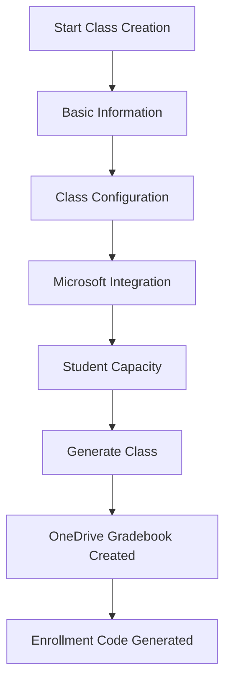
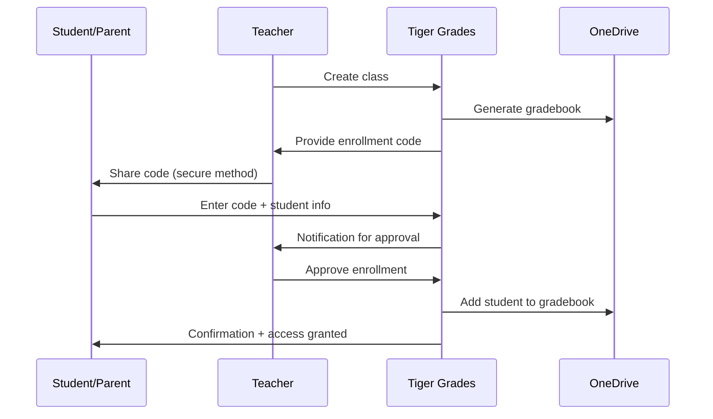

# Class Management 🏫

Tiger Grades provides powerful class management tools that streamline the entire educational workflow—from initial class creation to ongoing administration. Built with educators' real-world needs in mind, our system makes managing multiple classes, students, and assignments effortless.

## 🎯 Overview

Class Management in Tiger Grades encompasses:

- **Intuitive Class Creation** with Microsoft integration
- **Dynamic Enrollment Management** with secure codes
- **Flexible Class Organization** by subject, semester, and type
- **Automated Gradebook Generation** in OneDrive
- **Real-time Student Tracking** and progress monitoring
- **Comprehensive Reporting** for administrators and parents

## 🚀 Quick Start: Creating Your First Class

### The Class Creation Wizard

Tiger Grades features a step-by-step wizard that guides teachers through class setup:



### Essential Class Information

When creating a new class, teachers provide:

**Basic Details:**
- **Class Title** (e.g., "Advanced Biology", "AP Calculus AB")
- **Subject Area** from predefined categories
- **Academic Year** and semester
- **Class Description** for students and parents

**Configuration Options:**
- **Estimated Student Count** (affects gradebook layout)
- **Number of Grade Categories** (homework, tests, projects, etc.)
- **Start and End Dates** for the academic period
- **Welcome Message** displayed to enrolling students

## 📚 Class Types & Categories

### Predefined Subject Areas

Tiger Grades supports diverse educational contexts:

| Subject | Icon | Typical Categories |
|---------|------|-------------------|
| **English** 📝 | Reading, Writing, Grammar, Literature |
| **Mathematics** 🔢 | Homework, Quizzes, Tests, Projects |
| **Science** 🔬 | Labs, Experiments, Reports, Exams |
| **History** 📜 | Essays, Research, Presentations, Tests |
| **Foreign Language** 🌍 | Speaking, Listening, Writing, Cultural |
| **Art** 🎨 | Projects, Critiques, Technique, Portfolio |
| **Physical Education** ⚽ | Skills, Participation, Fitness, Games |
| **Chinese** 🇨🇳 | Characters, Speaking, Culture, Literature |

### Custom Subject Configuration

Administrators can add custom subjects to meet specific institutional needs:

```php
// Example: Adding a custom subject
$customSubject = [
    'title' => 'STEM Integration',
    'image_id' => 1925,
    'default_categories' => [
        'Engineering Design' => 30,
        'Scientific Method' => 25, 
        'Mathematical Modeling' => 25,
        'Technology Integration' => 20
    ]
];
```

## 🔐 Enrollment Management

### Secure Enrollment Codes

Each class receives a unique 6-character enrollment code that:
- **Expires automatically** after the enrollment period
- **Limits access** to intended students only
- **Tracks enrollment attempts** for security auditing
- **Prevents unauthorized access** through randomized generation

### Enrollment Workflow



### Enrollment Approval Process

Teachers maintain full control over class rosters through:

1. **Pending Requests** - Review student information before approval
2. **Verification Tools** - Confirm student identity and eligibility  
3. **Batch Approval** - Process multiple enrollments simultaneously
4. **Enrollment Limits** - Automatic blocking when class capacity is reached

## 📊 Class Dashboard & Overview

### Teacher Dashboard Components

The class management dashboard provides:

**Class Summary Cards:**
- Current enrollment count vs. capacity
- Recent grade activity and trends
- Upcoming assignment due dates
- Parent communication summary

**Quick Actions:**
- Generate new enrollment codes
- Export gradebook data
- Send class announcements
- Access detailed reports

**Visual Analytics:**
- Grade distribution charts
- Assignment completion rates
- Student progress trends
- Comparative class performance

### Real-Time Status Indicators

```typescript
interface ClassStatus {
    enrollment: {
        current: number;
        capacity: number;
        pending: number;
    };
    grades: {
        recent_updates: number;
        missing_assignments: number;
        completion_rate: number;
    };
    communication: {
        unread_messages: number;
        announcements_sent: number;
    };
}
```

## 🔄 Microsoft Integration Features

### Automatic Gradebook Creation

When a class is created, Tiger Grades automatically:

1. **Generates Excel Workbook** in teacher's OneDrive
2. **Creates Multiple Worksheets** for grades, categories, and averages
3. **Sets Up Formulas** for automatic calculation
4. **Configures Sharing Permissions** for read-only student access
5. **Establishes Sync Triggers** for real-time updates

### OneDrive File Structure

```
📁 Tiger Grades/
├── 📊 [Class Name] - [Year].xlsx
│   ├── 📋 Grades (main gradebook)
│   ├── 📊 Categories (assignment types & weights)
│   ├── 📈 Averages (calculated results)
│   └── 📝 Notes (teacher comments)
└── 📁 Archived Classes/
    └── 📊 Previous semester files...
```

### Gradebook Naming Convention

Tiger Grades generates unique, descriptive filenames:
- **Format**: `[Subject] [Level] [Section] - [Academic Year]`
- **Example**: `AP Biology Period 3 - 2024-2025.xlsx`
- **Collision Handling**: Automatic suffix addition for duplicates

## 👥 Student Management

### Class Roster Administration

**Student Information Tracking:**
- Full name and preferred name
- Parent/guardian contact information
- Emergency contact details
- Special accommodations or notes
- Enrollment date and status

**Bulk Operations:**
```php
// Example: Bulk student operations
$classManager = new ClassManagement();

// Export roster to CSV
$roster = $classManager->exportRoster($class_id, 'csv');

// Import students from external system
$result = $classManager->importStudents($class_id, $csv_data);

// Generate parent access codes
$codes = $classManager->generateParentCodes($class_id);
```

### Student Status Management

Students can have various status levels:
- **Active** - Currently enrolled and participating
- **Pending** - Enrollment submitted, awaiting teacher approval
- **Inactive** - Temporarily suspended or on leave
- **Transferred** - Moved to different class or school
- **Graduated** - Completed the course successfully

## 📈 Analytics & Reporting

### Class Performance Metrics

**Academic Performance:**
- Average grade by category and overall
- Grade distribution and class curves
- Assignment completion rates
- Trend analysis over time

**Engagement Metrics:**
- Login frequency and duration
- Assignment submission timeliness
- Parent portal usage statistics
- Communication response rates

### Automated Reports

Tiger Grades generates various reports automatically:

```typescript
interface ReportSchedule {
    weekly_summary: {
        recipients: ['teacher', 'administrator'];
        content: ['grade_updates', 'enrollment_changes', 'overdue_assignments'];
    };
    monthly_analytics: {
        recipients: ['teacher', 'department_head'];
        content: ['performance_trends', 'comparative_analysis', 'goal_progress'];
    };
    semester_reports: {
        recipients: ['administration', 'parents'];
        content: ['final_grades', 'standards_mastery', 'recommendations'];
    };
}
```

## 🛠️ Advanced Management Features

### Multi-Class Coordination

For teachers managing multiple classes:

**Cross-Class Analytics:**
- Compare performance across sections
- Identify successful teaching strategies
- Balance workload and assignment timing
- Coordinate with other teachers

**Shared Resources:**
- Template assignments and rubrics
- Common assessments and standards
- Collaborative grading workflows
- Departmental communication tools

### Archiving & History

**End-of-Term Procedures:**
1. **Grade Finalization** - Lock final grades from changes
2. **Archive Creation** - Move class data to historical storage
3. **Access Preservation** - Maintain read-only access for records
4. **Compliance Documentation** - Generate required administrative reports

## 🔧 Customization Options

### Class Templates

Create reusable templates for:
- Standard course configurations
- Departmental grading policies
- Assignment category structures
- Communication preferences

### Notification Settings

Customize alerts for:
- New enrollment requests
- Grade submission deadlines
- Parent communication
- System updates and maintenance

## 🚨 Troubleshooting Common Issues

### Enrollment Problems

**Issue**: Students can't find enrollment code
- **Solution**: Verify code hasn't expired; regenerate if necessary
- **Prevention**: Use secure distribution methods; set clear expiration dates

**Issue**: Gradebook not syncing with OneDrive
- **Solution**: Check Microsoft authentication; verify OneDrive permissions
- **Prevention**: Regular connection testing; backup authentication tokens

### Performance Optimization

**Large Class Management:**
- Use pagination for student lists
- Implement lazy loading for grade data
- Cache frequently accessed information
- Batch process enrollment approvals

---

Ready to create your first class? Jump to our [First Setup Tutorial](/docs/getting-started/first-setup) for a complete walkthrough! 