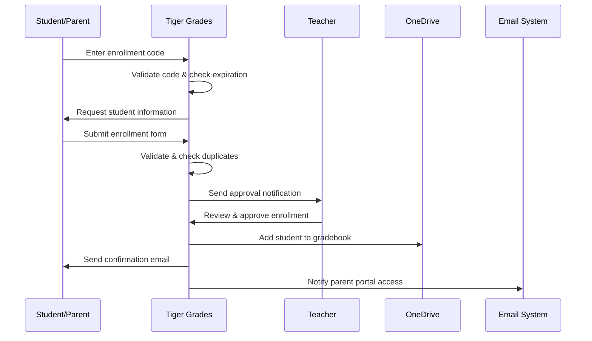

# Enrollment System 👥

Tiger Grades features a sophisticated enrollment system that streamlines student registration while maintaining security and administrative control. Our intelligent workflow ensures accurate class rosters, secure access management, and seamless integration with existing school systems.

## 🎯 Overview

The Tiger Grades Enrollment System provides:

- **Secure Enrollment Codes** with time-based expiration
- **Multi-Step Approval Workflow** for teacher control
- **Automated Verification** and duplicate detection
- **Bulk Enrollment Management** for administrative efficiency
- **Integration Ready** for SIS and LMS systems
- **Real-Time Status Tracking** for all stakeholders

## 🔐 Enrollment Security Model

### Secure Code Generation

Each class receives a unique enrollment code designed for maximum security:

```php
class EnrollmentCodeGenerator {
    private const CODE_LENGTH = 6;
    private const VALID_CHARACTERS = 'ABCDEFGHJKLMNPQRSTUVWXYZ23456789'; // Excludes confusing characters
    
    public function generateCode($class_id) {
        do {
            $code = '';
            for ($i = 0; $i < self::CODE_LENGTH; $i++) {
                $code .= self::VALID_CHARACTERS[random_int(0, strlen(self::VALID_CHARACTERS) - 1)];
            }
        } while ($this->codeExists($code)); // Ensure uniqueness
        
        return $code;
    }
}
```

### Code Security Features

**Anti-Collision Protection:**
- Cryptographically secure random generation
- Duplicate detection across all active codes
- Automatic regeneration when conflicts occur
- Character set optimization to prevent confusion

**Expiration Management:**
```sql
-- Enrollment codes with automatic expiration
CREATE TABLE wp_tigr_enrollment_codes (
    id BIGINT PRIMARY KEY AUTO_INCREMENT,
    class_id BIGINT NOT NULL,
    code VARCHAR(6) UNIQUE NOT NULL,
    created_at TIMESTAMP DEFAULT CURRENT_TIMESTAMP,
    expires_at TIMESTAMP NOT NULL,
    is_active BOOLEAN DEFAULT TRUE,
    max_uses INT DEFAULT NULL,
    current_uses INT DEFAULT 0
);
```

## 📝 Enrollment Workflow

### Student Registration Process

The enrollment journey follows a carefully designed multi-step process:



### Enrollment Form Fields

**Required Information:**
- Student full name (first, middle, last)
- Parent/guardian contact information
- Emergency contact details
- Special accommodations or notes

**Optional Fields:**
- Preferred name/nickname
- Previous school information
- Relevant medical information
- Transportation details

**Validation Rules:**
```javascript
const enrollmentValidation = {
    student_name: {
        required: true,
        minLength: 2,
        maxLength: 45,
        pattern: /^[a-zA-Z\s\-'\.]+$/
    },
    parent_email: {
        required: true,
        format: 'email',
        maxLength: 255
    },
    emergency_contact: {
        required: true,
        phone: true
    },
    special_notes: {
        maxLength: 500,
        sanitize: true
    }
};
```

## ✅ Approval & Management

### Teacher Review Dashboard

Teachers access a comprehensive dashboard for managing enrollment requests:

**Pending Enrollments:**
- Student information summary
- Parent contact details
- Enrollment timestamp
- Special notes or accommodations
- Quick approve/deny actions

**Approval Interface:**
```php
class EnrollmentApproval {
    public function displayPendingEnrollments($teacher_id) {
        $enrollments = $this->getPendingEnrollments($teacher_id);
        
        foreach ($enrollments as $enrollment) {
            echo $this->renderEnrollmentCard([
                'student_name' => $enrollment->student_name,
                'parent_info' => $enrollment->parent_contact,
                'submitted_date' => $enrollment->created,
                'actions' => [
                    'approve' => $this->getApprovalUrl($enrollment->id),
                    'deny' => $this->getDenialUrl($enrollment->id),
                    'request_info' => $this->getInfoRequestUrl($enrollment->id)
                ]
            ]);
        }
    }
}
```

### Batch Processing

**Bulk Operations:**
- Approve multiple enrollments simultaneously
- Export enrollment data for external systems
- Generate parent communication templates
- Create class roster snapshots

```php
// Bulk approval example
$bulkProcessor = new BulkEnrollmentProcessor();
$results = $bulkProcessor->processApprovals($enrollment_ids, [
    'auto_notify_parents' => true,
    'add_to_gradebook' => true,
    'send_welcome_email' => true,
    'create_portal_access' => true
]);
```

## 📊 Enrollment Analytics

### Real-Time Monitoring

**Enrollment Metrics:**
- Current enrollment vs. class capacity
- Enrollment rate trends over time
- Geographic distribution of students
- Peak enrollment periods

**Dashboard Widgets:**
```typescript
interface EnrollmentMetrics {
    current_enrollment: number;
    capacity: number;
    pending_requests: number;
    enrollment_rate: {
        daily: number;
        weekly: number;
        monthly: number;
    };
    demographics: {
        grade_levels: Record<string, number>;
        previous_schools: Record<string, number>;
        special_needs: number;
    };
}
```

### Predictive Analytics

**Enrollment Forecasting:**
- Predict final enrollment based on historical patterns
- Identify optimal enrollment periods
- Suggest capacity adjustments
- Alert for unusual enrollment activity

```python
def predict_enrollment(historical_data, current_trends):
    # Machine learning model for enrollment prediction
    model = EnrollmentPredictor()
    model.train(historical_data)
    
    prediction = model.predict(current_trends)
    
    return {
        'predicted_final_enrollment': prediction.final_count,
        'confidence_interval': prediction.confidence,
        'recommended_actions': prediction.suggestions
    }
```

## 🔄 Integration Capabilities

### Student Information System (SIS)

**Bidirectional Sync:**
- Import student data from existing SIS
- Export enrollment updates back to SIS
- Maintain data consistency across platforms
- Handle scheduling and demographic updates

**Integration API:**
```php
class SISIntegration {
    public function syncWithSIS($class_id) {
        $sisData = $this->fetchSISEnrollments($class_id);
        $tigerGradesData = $this->getTigerGradesEnrollments($class_id);
        
        $differences = $this->compareEnrollments($sisData, $tigerGradesData);
        
        foreach ($differences as $difference) {
            switch ($difference->type) {
                case 'new_in_sis':
                    $this->importFromSIS($difference->student);
                    break;
                case 'new_in_tiger':
                    $this->exportToSIS($difference->student);
                    break;
                case 'updated_in_sis':
                    $this->updateFromSIS($difference->student);
                    break;
            }
        }
    }
}
```

### Learning Management System (LMS)

**Course Enrollment Sync:**
- Automatic LMS course enrollment upon approval
- Grade passback configuration
- Assignment synchronization
- Progress tracking alignment

## 👨‍👩‍👧‍👦 Parent Portal Integration

### Account Creation

**Automatic Portal Setup:**
- Generate secure parent login credentials
- Link parent account to student enrollments
- Configure notification preferences
- Establish multi-child family accounts

**Family Account Management:**
```sql
-- Family structure for multiple children
CREATE TABLE wp_tigr_family_accounts (
    id BIGINT PRIMARY KEY AUTO_INCREMENT,
    parent_user_id BIGINT NOT NULL,
    family_name VARCHAR(100) NOT NULL,
    primary_contact_email VARCHAR(255) NOT NULL,
    created_at TIMESTAMP DEFAULT CURRENT_TIMESTAMP
);

CREATE TABLE wp_tigr_family_students (
    family_id BIGINT NOT NULL,
    student_enrollment_id BIGINT NOT NULL,
    relationship VARCHAR(50) NOT NULL, -- 'parent', 'guardian', 'emergency_contact'
    PRIMARY KEY (family_id, student_enrollment_id)
);
```

### Communication Automation

**Welcome Sequence:**
1. Enrollment approval confirmation
2. Portal access credentials
3. Getting started guide
4. First grade report availability
5. Parent conference scheduling

**Template System:**
```php
class EnrollmentCommunication {
    private $templates = [
        'approval_confirmation' => [
            'subject' => 'Enrollment Approved: {{student_name}} in {{class_title}}',
            'template' => 'enrollment/approval-confirmation.html',
            'delay' => 0
        ],
        'portal_access' => [
            'subject' => 'Parent Portal Access for {{student_name}}',
            'template' => 'enrollment/portal-access.html',
            'delay' => 300 // 5 minutes after approval
        ],
        'getting_started' => [
            'subject' => 'Getting Started with Tiger Grades',
            'template' => 'enrollment/getting-started.html',
            'delay' => 3600 // 1 hour after approval
        ]
    ];
}
```

## 🚨 Error Handling & Validation

### Duplicate Detection

**Smart Duplicate Prevention:**
- Name similarity matching using Levenshtein distance
- Email address verification
- Phone number cross-referencing
- Parent notification for suspected duplicates

```php
class DuplicateDetector {
    public function checkForDuplicates($enrollment_data) {
        $potential_duplicates = [];
        
        // Check name similarity
        $name_matches = $this->findSimilarNames(
            $enrollment_data['student_name'],
            0.8 // 80% similarity threshold
        );
        
        // Check email matches
        $email_matches = $this->findEmailMatches(
            $enrollment_data['parent_email']
        );
        
        // Check phone matches
        $phone_matches = $this->findPhoneMatches(
            $enrollment_data['emergency_contact']
        );
        
        return array_merge($name_matches, $email_matches, $phone_matches);
    }
}
```

### Error Recovery

**Graceful Failure Handling:**
- Automatic retry mechanisms for failed operations
- Detailed error logging for debugging
- User-friendly error messages
- Administrative alerting for critical failures

## 🔧 Administrative Tools

### Enrollment Management Dashboard

**Administrative Overview:**
- School-wide enrollment statistics
- Teacher-specific metrics
- Capacity planning tools
- Enrollment trend analysis

**Bulk Management Operations:**
```php
class AdminEnrollmentTools {
    public function bulkTransferStudents($from_class_id, $to_class_id, $student_ids) {
        DB::transaction(function() use ($from_class_id, $to_class_id, $student_ids) {
            foreach ($student_ids as $student_id) {
                $this->transferStudent($student_id, $from_class_id, $to_class_id);
                $this->notifyStakeholders($student_id, $from_class_id, $to_class_id);
                $this->updateGradebooks($student_id, $from_class_id, $to_class_id);
            }
        });
    }
    
    public function exportEnrollmentReport($filters = []) {
        $data = $this->getEnrollmentData($filters);
        return $this->generateCSVReport($data, [
            'student_name',
            'class_title',
            'teacher_name',
            'enrollment_date',
            'status',
            'parent_contact'
        ]);
    }
}
```

### Compliance & Reporting

**Regulatory Compliance:**
- FERPA-compliant data handling
- State enrollment reporting
- Attendance tracking integration
- Special education accommodations

**Audit Trail:**
```sql
-- Enrollment audit log
CREATE TABLE wp_tigr_enrollment_audit (
    id BIGINT PRIMARY KEY AUTO_INCREMENT,
    enrollment_id BIGINT NOT NULL,
    action VARCHAR(50) NOT NULL, -- 'created', 'approved', 'denied', 'transferred'
    user_id BIGINT NOT NULL,
    timestamp TIMESTAMP DEFAULT CURRENT_TIMESTAMP,
    details JSON,
    ip_address VARCHAR(45)
);
```

## 🏆 Best Practices

### For Teachers
- **Timely Review**: Process enrollment requests within 24 hours
- **Clear Communication**: Provide specific feedback for denied enrollments
- **Capacity Planning**: Monitor enrollment trends for resource allocation
- **Parent Engagement**: Use enrollment as an opportunity for initial contact

### For Administrators
- **Policy Consistency**: Establish clear enrollment policies and procedures
- **Data Accuracy**: Implement quality control measures for student information
- **Privacy Protection**: Train staff on proper handling of student data
- **System Monitoring**: Regular audits of enrollment processes and security

### For IT Staff
- **Performance Monitoring**: Track system performance during peak enrollment periods
- **Security Updates**: Keep enrollment systems updated with latest security patches
- **Backup Procedures**: Ensure enrollment data is properly backed up
- **Integration Testing**: Regularly test SIS and LMS integrations

---

Ready to set up enrollment for your classes? Check out our [Teacher Guide](/docs/user-guides/teachers) for step-by-step instructions on managing student enrollments! 