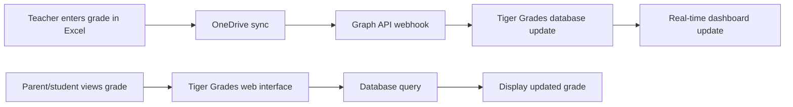

# Grading System 📊

Tiger Grades features a sophisticated, flexible grading system designed to meet the diverse needs of modern educational institutions. Built with both simplicity and power in mind, our grading engine supports multiple assessment methods while maintaining transparency for all stakeholders.

## 🎯 Overview

The Tiger Grades grading system provides:

- **Real-time Grade Calculations** with automatic updates
- **Flexible Category Weighting** for different assignment types  
- **Standards-Based Assessment** options
- **Multi-Semester Support** for year-long courses
- **Progress Tracking** with visual analytics
- **Automated Report Generation** for parents and students

## 📋 Grade Categories & Weighting

### Category Configuration

Teachers can organize assignments into customizable categories:

```php
// Example category structure
$categories = [
    'homework' => ['weight' => 25, 'color' => '#4CAF50'],
    'quizzes' => ['weight' => 25, 'color' => '#FF9800'], 
    'exams' => ['weight' => 40, 'color' => '#F44336'],
    'participation' => ['weight' => 10, 'color' => '#2196F3']
];
```

### Dynamic Weight Adjustment

The system automatically handles:
- **Proportional Recalculation** when categories are added/removed
- **Zero-Weight Handling** for unused categories
- **Custom Scaling** for different grading scales (100-point, 4.0 GPA, etc.)

## 🔢 Grade Calculation Engine

### Core Algorithm

Tiger Grades uses a weighted average system with intelligent handling of edge cases:

```typescript
function calculateWeightedAverage(assignments: Assignment[], categories: Category[]): number {
    let totalPoints = 0;
    let totalWeight = 0;
    
    categories.forEach(category => {
        const categoryAssignments = assignments.filter(a => a.category === category.id);
        if (categoryAssignments.length > 0) {
            const categoryAverage = categoryAssignments.reduce((sum, a) => sum + a.score, 0) / categoryAssignments.length;
            totalPoints += categoryAverage * category.weight;
            totalWeight += category.weight;
        }
    });
    
    return totalWeight > 0 ? totalPoints / totalWeight : 0;
}
```

### Special Grade Handling

The system intelligently processes:
- **Exempt Grades** (marked as 'E') - excluded from calculations
- **Missing Assignments** (marked as 'M') - handled per teacher preference  
- **Extra Credit** - can exceed category maximum
- **Late Penalties** - automatic or manual deductions

## 📈 Standards-Based Grading

### Proficiency Levels

Tiger Grades supports standards-based assessment with customizable proficiency scales:

| Level | Description | Numeric Value |
|-------|-------------|---------------|
| **Exceeding** | Demonstrates mastery beyond grade level | 4.0 |
| **Meeting** | Demonstrates grade-level mastery | 3.0 |
| **Approaching** | Progressing toward mastery | 2.0 |
| **Beginning** | Beginning to develop understanding | 1.0 |

### Standards Tracking

Each assignment can be linked to learning standards for comprehensive progress monitoring:

```json
{
  "assignment": "Fraction Operations Quiz",
  "standards": [
    "5.NF.A.1", // Add and subtract fractions
    "5.NF.A.2", // Solve word problems with fractions
  ],
  "proficiency_scores": {
    "5.NF.A.1": 3.5,
    "5.NF.A.2": 2.8
  }
}
```

## 📊 Grade Analytics & Insights

### Visual Progress Tracking

Tiger Grades generates comprehensive analytics including:

- **Trend Analysis** - Grade progression over time
- **Category Performance** - Strengths and areas for improvement  
- **Comparative Analytics** - Class averages and percentiles
- **Predictive Modeling** - Projected final grades based on current performance

### Parent & Student Dashboards

Real-time grade visualizations include:
- Interactive grade charts with drill-down capability
- Category-specific performance breakdowns
- Assignment timeline with due dates and scores
- Progress toward learning objectives

## 🔄 Real-Time Synchronization

### Excel Integration

Tiger Grades maintains two-way synchronization with Excel gradebooks stored in OneDrive:



### Conflict Resolution

The system handles simultaneous edits through:
- **Timestamp-based precedence** for concurrent updates
- **Teacher override capability** for final grade authority
- **Audit logging** for all grade changes
- **Rollback functionality** for error correction

## 🎨 Customization Options

### Grading Scales

Support for multiple grading scales:

```php
$gradingScales = [
    'percentage' => ['min' => 0, 'max' => 100, 'passing' => 70],
    'letter' => ['A' => 90, 'B' => 80, 'C' => 70, 'D' => 60, 'F' => 0],
    'ib' => ['min' => 1, 'max' => 7, 'passing' => 4],
    'cambridge' => ['A*' => 90, 'A' => 80, 'B' => 70, 'C' => 60]
];
```

### Color Coding

Automatic color coding for quick visual assessment:
- 🟢 **Green** (90-100%): Excellent performance
- 🟡 **Yellow** (70-89%): Good performance  
- 🟠 **Orange** (60-69%): Needs improvement
- 🔴 **Red** (0-59%): Requires intervention

## 🔐 Security & Privacy

### Grade Privacy Controls

- **Role-based access** ensures students only see their own grades
- **Parent verification** through secure enrollment codes
- **Teacher permissions** for grade modification and viewing
- **Audit trails** for all grade-related actions

### FERPA Compliance

Tiger Grades maintains strict educational privacy standards:
- Encrypted data transmission
- Secure authentication requirements  
- Limited data retention policies
- Consent-based information sharing

## 🚀 Advanced Features

### Semester Management

Handle complex academic calendars:
- **Multi-semester courses** with separate grade books
- **Quarter/trimester systems** with weighted periods
- **Summer session support** with accelerated timelines
- **Grade migration** between academic periods

### Bulk Operations

Streamline grading workflows:
- **CSV import/export** for external systems
- **Batch grade entry** for large classes
- **Template assignments** for recurring assessments
- **Grade distribution analysis** for curve adjustments

## 🛠️ API Integration

### Grade Retrieval

```php
// Fetch student grades for a specific class
$grades = TigerGradesAPI::fetchReportCard(
    $student_id,
    $enrollment_id, 
    'date', // sort by
    'all'   // grade type filter
);
```

### Grade Submission

```php
// Submit new grade via API
$result = TigerGradesAPI::submitGrade([
    'student_id' => 12345,
    'assignment_id' => 67890,
    'score' => 95.5,
    'notes' => 'Excellent work on problem solving'
]);
```

## 🏆 Best Practices

### For Teachers
- **Consistent Categories**: Use standardized category names across similar courses
- **Regular Updates**: Enter grades within 48 hours for optimal student engagement
- **Clear Rubrics**: Provide detailed scoring criteria for major assignments
- **Parent Communication**: Use grade comments for meaningful feedback

### For Administrators  
- **Policy Consistency**: Establish school-wide grading policies and scales
- **Training Programs**: Provide comprehensive teacher training on system features
- **Data Analysis**: Use aggregate reporting for curriculum effectiveness assessment
- **Security Audits**: Regular review of access logs and permission settings

---

Ready to master the grading system? Check out our [Teacher Guide](/docs/user-guides/teachers) for detailed workflows and best practices! 