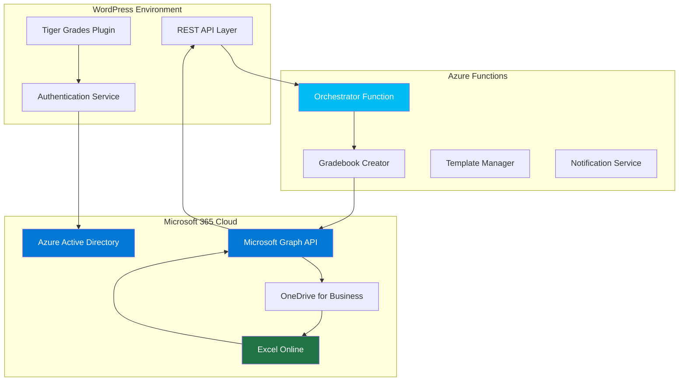

# Microsoft 365 Integration

Tiger Grades' **revolutionary Microsoft 365 integration** transforms traditional gradebook management through seamless Azure cloud connectivity. This enterprise-grade integration leverages Microsoft Graph API, Azure Functions, and OneDrive to create an automated, intelligent education ecosystem.

## 🌟 **Integration Overview**

### **What Makes It Revolutionary**

Tiger Grades doesn't just "connect" to Microsoft 365—it **orchestrates** an entire cloud-based gradebook lifecycle:



### **Core Integration Components**

1. **🔐 Azure AD Authentication**: Enterprise OAuth 2.0 with client credentials flow
2. **📊 Graph API Connectivity**: Real-time data synchronization with Office 365
3. **☁️ Azure Functions Orchestration**: Serverless gradebook creation and management
4. **📁 OneDrive Automation**: Intelligent folder structure and file management
5. **📈 Excel Integration**: Direct spreadsheet manipulation and formula preservation

## 🚀 **Automated Gradebook Creation**

### **The Magic Behind the Scenes**

When a teacher creates a class, Tiger Grades triggers a sophisticated **Azure Functions orchestration**:

```php
// Teacher creates class in WordPress
class TeachersAPI {
    public function handle_create_class_request($request) {
        // 1. Create class record in WordPress
        $class_data = $this->classRepository->createClass($request_data);
        
        // 2. Generate unique gradebook name
        $gradebook_name = $this->produce_unique_gradebook_name(
            $class_data->title, 
            $class_data->teacher_id
        );
        
        // 3. Trigger Azure orchestration
        $microservice_response = $this->call_class_registration_microservice(
            $teacher_data->folder_name,
            $teacher_data->folder_id,
            $gradebook_name,
            $teacher_data->email,
            $class_data->id
        );
        
        return new WP_REST_Response($class_data, 200);
    }
}
```

### **Azure Functions Orchestration Flow**

```javascript
// Azure Functions Orchestrator (simplified)
const orchestrator = df.orchestrator(function* (context) {
    const input = context.df.getInput();
    
    // Step 1: Authenticate with Microsoft Graph
    const accessToken = yield context.df.callActivity('GetGraphToken');
    
    // Step 2: Create teacher's OneDrive folder (if needed)
    const folderData = yield context.df.callActivity('CreateTeacherFolder', {
        teacherName: input.teacher_name,
        email: input.email,
        token: accessToken
    });
    
    // Step 3: Copy gradebook template
    const gradebookTemplate = yield context.df.callActivity('CopyGradebookTemplate', {
        folderId: folderData.id,
        gradebookName: input.gradebook_name,
        token: accessToken
    });
    
    // Step 4: Customize gradebook for class
    const customizedGradebook = yield context.df.callActivity('CustomizeGradebook', {
        gradebookId: gradebookTemplate.id,
        classData: input,
        token: accessToken
    });
    
    // Step 5: Notify WordPress of completion
    yield context.df.callActivity('NotifyWordPress', {
        classId: input.class_id,
        gradebookId: customizedGradebook.id,
        gradebookUrl: customizedGradebook.webUrl
    });
    
    return customizedGradebook;
});
```

### **Real-Time Status Updates**

Teachers see their classes progress through states in real-time:

```javascript
// WordPress frontend polling
const pollClassStatus = (classId) => {
    const statusIndicator = document.querySelector(`[data-class-id="${classId}"] .status`);
    
    const interval = setInterval(async () => {
        const response = await fetch(`/wp-json/tiger-grades/v1/class-status?id=${classId}`, {
            headers: { 'X-WP-Nonce': nonce }
        });
        const data = await response.json();
        
        statusIndicator.textContent = data.status;
        statusIndicator.className = `status status-${data.status}`;
        
        if (data.status === 'active') {
            clearInterval(interval);
            showSuccessNotification('Your gradebook is ready!');
            refreshClassList();
        }
    }, 3000);
};
```

## 🔐 **Enterprise Authentication Architecture**

### **OAuth 2.0 Client Credentials Flow**

Tiger Grades implements **enterprise-grade authentication** using Azure AD's client credentials flow:

```php
class MicrosoftAuthService {
    private $tenant_id;
    private $client_id;
    private $client_secret;
    private $jwt_token_manager;
    
    public function getAccessToken($scope = 'https://graph.microsoft.com/.default') {
        // OAuth 2.0 Token Endpoint
        $token_url = "https://login.microsoftonline.com/{$this->tenant_id}/oauth2/v2.0/token";
        
        $post_data = http_build_query([
            'client_id' => $this->client_id,
            'scope' => $scope,
            'client_secret' => $this->client_secret,
            'grant_type' => 'client_credentials'
        ]);
        
        $response = $this->http_service->makeHttpRequest($token_url, 'POST', [
            'Content-Type' => 'application/x-www-form-urlencoded'
        ], $post_data);
        
        if ($response && !is_wp_error($response)) {
            $token_data = json_decode(wp_remote_retrieve_body($response));
            
            // Store token with automatic expiration handling
            $this->jwt_token_manager->store_token(
                $token_data->access_token, 
                $token_data->expires_in
            );
            
            return true;
        }
        
        return false;
    }
}
```

### **Token Management & Caching**

```php
class JwtTokenManager {
    private $token_key;
    private $expiration_buffer = 300; // 5 minutes
    
    public function store_token($token, $expires_in) {
        $expiration = time() + $expires_in - $this->expiration_buffer;
        
        set_transient($this->token_key, [
            'token' => $token,
            'expires' => $expiration
        ], $expires_in);
    }
    
    public function get_token() {
        $token_data = get_transient($this->token_key);
        
        if ($token_data && $token_data['expires'] > time()) {
            return $token_data['token'];
        }
        
        return null; // Token expired or doesn't exist
    }
}
```

## 📊 **Real-Time Grade Synchronization**

### **Microsoft Graph API Integration**

Tiger Grades fetches grade data directly from Excel using **Microsoft Graph API**:

```php
class TigerGradesAPI {
    public function fetchReportCard($user_id, $enrollment_id, $sort_by, $type, $is_teacher) {
        // Get gradebook ID from class data
        $class = $this->classRepository->getClassFromEnrollment($enrollment_id);
        $gradebook_id = $class->gradebook_id;
        
        // Microsoft Graph API endpoint for Excel data
        $grades_url = "https://graph.microsoft.com/v1.0/users/{$this->msft_user_id}/drive/items/{$gradebook_id}/workbook/worksheets/grades/usedRange";
        
        $access_token = $this->auth_service->getToken();
        
        $headers = [
            'Authorization' => "Bearer {$access_token}",
            'Content-Type' => 'application/json'
        ];
        
        // Fetch data from Excel
        $response = $this->http_service->getJson($grades_url, $headers);
        
        if (!is_wp_error($response)) {
            return $this->processExcelData($response->text, $type, $sort_by);
        }
        
        return $response;
    }
    
    private function processExcelData($excel_data, $type, $sort_by) {
        // Extract structured data from Excel worksheet
        $dates = $excel_data[0];        // Row 1: Assignment dates
        $types = $excel_data[1];        // Row 2: Assignment types
        $totals = $excel_data[2];       // Row 3: Point totals
        $names = $excel_data[3];        // Row 4: Assignment names
        
        $processed_grades = [];
        
        // Process each grade entry
        for ($col = 4; $col < count($dates); $col++) {
            if (empty($dates[$col])) continue;
            
            $grade_entry = [
                'date' => $this->formatDate($dates[$col]),
                'type' => strtolower($types[$col]),
                'type_label' => $types[$col],
                'total_points' => (float)$totals[$col],
                'assignment_name' => $names[$col],
                'student_score' => $this->getStudentScore($excel_data, $col),
                'percentage' => $this->calculatePercentage($excel_data, $col, $totals[$col])
            ];
            
            // Filter by type if specified
            if ($type === 'all' || $grade_entry['type'] === strtolower($type)) {
                $processed_grades[] = $grade_entry;
            }
        }
        
        // Sort grades according to user preference
        usort($processed_grades, function($a, $b) use ($sort_by) {
            if ($sort_by === 'date') {
                return strtotime($b['date']) - strtotime($a['date']);
            }
            return strcmp($a[$sort_by], $b[$sort_by]);
        });
        
        return $processed_grades;
    }
}
```

### **Multi-Worksheet Support**

Tiger Grades intelligently handles **multiple Excel worksheets** for comprehensive grade management:

```php
// Fetch data from both grades and averages worksheets
$grades_data = $this->fetchWorksheetData($gradebook_id, 'grades');
$averages_data = $this->fetchWorksheetData($gradebook_id, 'averages');
$categories_data = $this->fetchWorksheetData($gradebook_id, 'categories');

private function fetchWorksheetData($gradebook_id, $worksheet_name) {
    $url = "https://graph.microsoft.com/v1.0/users/{$this->msft_user_id}/drive/items/{$gradebook_id}/workbook/worksheets/{$worksheet_name}/usedRange";
    
    return $this->http_service->getJson($url, $this->getAuthHeaders());
}
```

## 📁 **Intelligent OneDrive Management**

### **Automatic Folder Organization**

Tiger Grades creates and maintains an **organized folder structure** in teachers' OneDrive:

```
📁 Tiger Grades/
├── 📁 Teacher Name/
│   ├── 📊 Math_Class_Gradebook.xlsx
│   ├── 📊 Science_Class_Gradebook.xlsx
│   └── 📁 Templates/
│       ├── 📊 Standard_Gradebook_Template.xlsx
│       └── 📊 Advanced_Gradebook_Template.xlsx
├── 📁 Shared Resources/
│   ├── 📄 Grading_Guidelines.pdf
│   └── 📊 Category_Weight_Examples.xlsx
└── 📁 Archived Classes/
    └── 📊 Previous_Semester_Archives.xlsx
```

### **Template System**

```javascript
// Azure Function: Template Management
const copyGradebookTemplate = async (context) => {
    const { folderId, gradebookName, classMetadata } = context.bindings.input;
    
    // 1. Copy base template
    const copyRequest = {
        name: gradebookName,
        parentReference: { id: folderId }
    };
    
    const copiedFile = await graphClient
        .me
        .drive
        .items(TEMPLATE_FILE_ID)
        .copy(copyRequest);
    
    // 2. Wait for copy operation to complete
    await waitForCopyCompletion(copiedFile.id);
    
    // 3. Customize template with class data
    await customizeGradebookTemplate(copiedFile.id, classMetadata);
    
    return copiedFile;
};
```

## 🔄 **Bi-Directional Synchronization**

### **Real-Time Updates**

Changes in Excel are **immediately reflected** in Tiger Grades:

```javascript
// Webhook handler for Excel changes (Azure Function)
const handleExcelWebhook = async (context) => {
    const changeNotification = context.bindings.webhook;
    
    if (changeNotification.changeType === 'updated') {
        // Extract gradebook ID and changed range
        const gradebookId = extractGradebookId(changeNotification.resource);
        const changedRange = changeNotification.resourceData.range;
        
        // Notify WordPress of changes
        await notifyWordPressOfChanges({
            gradebookId,
            changedRange,
            timestamp: new Date().toISOString()
        });
    }
};

// WordPress: Handle change notifications
add_action('rest_api_init', function() {
    register_rest_route('tiger-grades/v1', '/excel-webhook', [
        'methods' => 'POST',
        'callback' => 'handle_excel_change_notification',
        'permission_callback' => 'verify_azure_webhook_signature'
    ]);
});
```

## 📈 **Advanced Excel Features**

### **Formula Preservation**

Tiger Grades **preserves complex Excel formulas** while adding automation:

```javascript
// Maintain existing formulas while updating data
const updateGradesWithFormulaPreservation = async (gradebookId, newGrades) => {
    // 1. Read current formulas
    const formulaRange = await graphClient
        .me
        .drive
        .items(gradebookId)
        .workbook
        .worksheets('grades')
        .range('A1:Z100')
        .formulas
        .get();
    
    // 2. Update only data cells, preserve formula cells
    const updates = newGrades.map((grade, index) => {
        const cellAddress = `${getColumnLetter(index + 4)}${grade.rowIndex}`;
        return {
            address: cellAddress,
            values: [[grade.value]],
            preserveFormula: true
        };
    });
    
    // 3. Batch update cells
    await graphClient
        .me
        .drive
        .items(gradebookId)
        .workbook
        .worksheets('grades')
        .range()
        .patch(updates);
};
```

### **Category Weight Management**

```php
// Fetch and update category weights
public function fetchClassMetadata($type, $enrollment_id, $is_teacher = false) {
    $categories_url = "{$this->graph_api_url}/categories/usedRange";
    
    $categories_data = $this->httpService->getJson($categories_url, $this->getAuthHeaders());
    
    return $this->findWeightByType($categories_data->text, $type);
}

private function findWeightByType($categories_data, $type) {
    $result = new stdClass();
    $result->type = $type;
    $result->weight = null;
    
    // Search through categories worksheet for weight
    for ($row = 1; $row < count($categories_data); $row++) {
        if (isset($categories_data[$row][1]) && 
            strtolower($categories_data[$row][1]) === strtolower($type)) {
            $result->type_label = $categories_data[$row][1];
            $result->weight = $categories_data[$row][2];
            break;
        }
    }
    
    return $result;
}
```

## 🔧 **Setup & Configuration**

### **Azure App Registration**

1. **Create Azure App Registration**:
   ```bash
   # Using Azure CLI
   az ad app create \
     --display-name "Tiger Grades Integration" \
     --available-to-other-tenants false \
     --required-resource-accesses @graph-permissions.json
   ```

2. **Required Microsoft Graph Permissions**:
   ```json
   {
     "requiredResourceAccess": [
       {
         "resourceAppId": "00000003-0000-0000-c000-000000000000",
         "resourceAccess": [
           {
             "id": "1bfefb4e-e0b5-418b-a88f-73c46d2cc8e9",
             "type": "Role"
           },
           {
             "id": "19dbc75e-c2e2-444c-a770-ec69d8559fc7",
             "type": "Role"
           }
         ]
       }
     ]
   }
   ```

### **WordPress Environment Variables**

```php
// wp-config.php
define('MSFT_TENANT_ID', 'your-tenant-id');
define('MSFT_CLIENT_ID', 'your-client-id');
define('MSFT_CLIENT_SECRET', 'your-client-secret');
define('MSFT_USER_ID', 'your-service-account-user-id');
define('TIGER_GRADES_AZURE_FUNCTIONS_BASE_URL', 'https://your-functions-app.azurewebsites.net');
define('TIGER_GRADES_AZURE_FUNCTIONS_AUDIENCE', 'api://your-functions-app-id');
```

### **Azure Functions Deployment**

```yaml
# azure-functions.yml
name: Deploy Azure Functions
on:
  push:
    branches: [main]
    paths: ['azure-functions/**']

jobs:
  deploy:
    runs-on: ubuntu-latest
    steps:
      - uses: actions/checkout@v2
      
      - name: Setup Node.js
        uses: actions/setup-node@v2
        with:
          node-version: '18'
          
      - name: Install dependencies
        run: npm install
        working-directory: azure-functions
        
      - name: Deploy to Azure Functions
        uses: Azure/functions-action@v1
        with:
          app-name: tiger-grades-functions
          package: azure-functions
          publish-profile: ${{ secrets.AZURE_FUNCTIONAPP_PUBLISH_PROFILE }}
```

## 🚀 **Performance & Scalability**

### **Caching Strategy**

```php
// Intelligent caching for Graph API responses
class GraphAPICache {
    private $cache_duration = 300; // 5 minutes
    
    public function getCachedGradeData($gradebook_id, $worksheet) {
        $cache_key = "graph_api_{$gradebook_id}_{$worksheet}";
        return get_transient($cache_key);
    }
    
    public function setCachedGradeData($gradebook_id, $worksheet, $data) {
        $cache_key = "graph_api_{$gradebook_id}_{$worksheet}";
        set_transient($cache_key, $data, $this->cache_duration);
    }
    
    public function invalidateCache($gradebook_id) {
        // Clear all cached data for specific gradebook
        global $wpdb;
        $wpdb->query($wpdb->prepare(
            "DELETE FROM {$wpdb->options} WHERE option_name LIKE %s",
            '_transient_graph_api_' . $gradebook_id . '_%'
        ));
    }
}
```

### **Rate Limiting & Throttling**

```php
// Respect Microsoft Graph API rate limits
class GraphAPIThrottle {
    private $requests_per_minute = 600;
    private $burst_limit = 100;
    
    public function canMakeRequest() {
        $current_requests = get_transient('graph_api_requests_count') ?: 0;
        
        if ($current_requests >= $this->requests_per_minute) {
            return false;
        }
        
        // Increment counter
        set_transient('graph_api_requests_count', $current_requests + 1, 60);
        
        return true;
    }
    
    public function waitForRateLimit() {
        while (!$this->canMakeRequest()) {
            sleep(1); // Wait 1 second before retrying
        }
    }
}
```

## 🔒 **Security Best Practices**

### **Secure Configuration**

```php
// Environment-based configuration
class SecureConfig {
    public static function getMicrosoftCredentials() {
        // Never store credentials in code
        return [
            'tenant_id' => getenv('MSFT_TENANT_ID'),
            'client_id' => getenv('MSFT_CLIENT_ID'),
            'client_secret' => getenv('MSFT_CLIENT_SECRET')
        ];
    }
    
    public static function validateCredentials() {
        $credentials = self::getMicrosoftCredentials();
        
        foreach ($credentials as $key => $value) {
            if (empty($value)) {
                throw new Exception("Missing Microsoft credential: {$key}");
            }
        }
    }
}
```

### **Access Control**

```php
// Granular permission checking
class MicrosoftIntegrationPermissions {
    public static function canAccessGradebook($user_id, $gradebook_id) {
        // Check if user is teacher of the class
        $class = TigerClassRepository::getClassByGradebookId($gradebook_id);
        
        if (!$class || $class->teacher_id !== $user_id) {
            return false;
        }
        
        // Additional security checks
        return user_can($user_id, 'manage_tiger_grades') &&
               self::isGradebookActive($gradebook_id);
    }
    
    private static function isGradebookActive($gradebook_id) {
        // Verify gradebook still exists in OneDrive
        $auth_service = new MicrosoftAuthService('tigr_graph_api');
        
        if (!$auth_service->getAccessToken()) {
            return false;
        }
        
        $url = "https://graph.microsoft.com/v1.0/me/drive/items/{$gradebook_id}";
        $response = HttpService::getInstance()->getJson($url, [
            'Authorization' => 'Bearer ' . $auth_service->getToken()
        ]);
        
        return !is_wp_error($response);
    }
}
```

## 🎯 **Troubleshooting Common Issues**

### **Authentication Problems**

```php
// Debug authentication issues
class MicrosoftAuthDebug {
    public static function diagnoseAuthIssue() {
        $diagnostics = [];
        
        // Check environment variables
        $required_vars = ['MSFT_TENANT_ID', 'MSFT_CLIENT_ID', 'MSFT_CLIENT_SECRET'];
        foreach ($required_vars as $var) {
            $diagnostics[$var] = [
                'set' => !empty(getenv($var)),
                'length' => strlen(getenv($var))
            ];
        }
        
        // Test token acquisition
        try {
            $auth_service = new MicrosoftAuthService('test');
            $token_acquired = $auth_service->getAccessToken();
            $diagnostics['token_test'] = $token_acquired;
        } catch (Exception $e) {
            $diagnostics['token_error'] = $e->getMessage();
        }
        
        return $diagnostics;
    }
}
```

This Microsoft 365 integration represents the **pinnacle of educational technology**, combining the familiarity of Excel with the power of modern cloud infrastructure to create an unparalleled gradebook experience. 🚀📊 