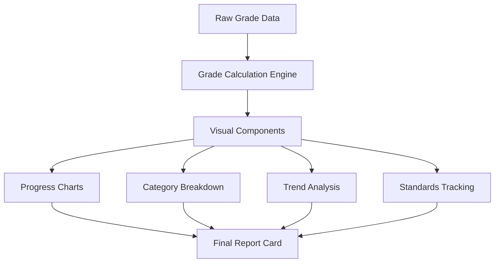

# Report Cards 📋

Tiger Grades revolutionizes academic reporting with dynamic, real-time report cards that provide comprehensive insights into student progress. Our intelligent reporting system transforms raw grade data into meaningful, actionable information for students, parents, and educators.

## 🎯 Overview

Tiger Grades Report Cards offer:

- **Real-Time Generation** from live gradebook data
- **Multi-Format Export** (PDF, Excel, Web view)
- **Customizable Templates** for different academic contexts
- **Standards-Based Reporting** with proficiency tracking
- **Visual Progress Indicators** and trend analysis
- **Parent-Friendly Formatting** with clear explanations

## 📊 Report Card Components

### Core Academic Information

Every Tiger Grades report card includes:

**Student Identification:**
- Full name and student ID
- Class/grade level and section
- Academic period and year
- Teacher name and contact

**Grade Summary:**
- Overall class average
- Category breakdowns (homework, tests, projects, etc.)
- Letter grade equivalents
- Grade point average (when applicable)

**Performance Metrics:**
- Assignment completion rate
- Improvement trends
- Class rank (optional)
- Standards mastery levels

### Visual Elements



## 🎨 Report Card Types & Templates

### Standard Academic Report

The default template includes:

```typescript
interface StandardReport {
    header: {
        student_info: StudentProfile;
        academic_period: AcademicPeriod;
        generation_date: Date;
    };
    grades: {
        overall_average: number;
        category_breakdowns: CategoryGrade[];
        assignment_list: Assignment[];
        missing_work: Assignment[];
    };
    analytics: {
        progress_chart: ProgressData[];
        comparative_metrics: ClassComparison;
        improvement_areas: string[];
    };
    comments: {
        teacher_notes: string;
        automated_insights: string[];
    };
}
```

### Standards-Based Report

For competency-based education:

**Proficiency Scales:**
- **4 - Exceeding**: Demonstrates mastery beyond expectations
- **3 - Meeting**: Demonstrates grade-level mastery
- **2 - Approaching**: Progressing toward mastery
- **1 - Beginning**: Beginning to develop understanding

**Standards Tracking:**
```json
{
  "math_standards": {
    "5.NBT.A.1": { "proficiency": 3.2, "trend": "improving" },
    "5.NBT.A.2": { "proficiency": 2.8, "trend": "stable" },
    "5.NBT.B.5": { "proficiency": 3.5, "trend": "exceeding" }
  },
  "overall_mastery": 3.17
}
```

### Progress Reports

Mid-term progress snapshots featuring:
- Current grade status
- Upcoming assignment alerts
- Intervention recommendations
- Parent conference scheduling

## 🔄 Real-Time Data Integration

### Live Grade Synchronization

Tiger Grades report cards reflect the most current data through:

**Automatic Updates:**
- Immediate reflection of new grades
- Dynamic recalculation of averages
- Real-time category weight adjustments
- Instant missing assignment alerts

**Data Sources:**
```php
class ReportCardDataSource {
    public function fetchLiveData($student_id, $class_id) {
        return [
            'grades' => $this->getGradesFromExcel($class_id),
            'assignments' => $this->getAssignmentList($class_id),
            'attendance' => $this->getAttendanceData($student_id),
            'standards' => $this->getStandardsProgress($student_id, $class_id)
        ];
    }
}
```

### Microsoft Excel Integration

Report cards pull directly from OneDrive gradebooks:

**Data Flow:**
1. Teacher updates grade in Excel
2. OneDrive syncs changes
3. Graph API webhook triggers update
4. Tiger Grades database refreshes
5. Report card reflects new data instantly

## 📈 Analytics & Insights

### Performance Visualization

**Grade Trend Charts:**
- Line graphs showing grade progression over time
- Category performance radar charts
- Comparison with class averages
- Goal achievement tracking

**Interactive Elements:**
```javascript
// Example: Interactive grade chart
const gradeChart = {
    type: 'line',
    data: {
        labels: assignmentDates,
        datasets: [{
            label: 'Student Grades',
            data: gradeValues,
            borderColor: '#4CAF50',
            tension: 0.4
        }, {
            label: 'Class Average',
            data: classAverages,
            borderColor: '#FF9800',
            borderDash: [5, 5]
        }]
    },
    options: {
        responsive: true,
        plugins: {
            tooltip: {
                callbacks: {
                    afterBody: function(context) {
                        return 'Click for assignment details';
                    }
                }
            }
        }
    }
};
```

### Predictive Analytics

**Grade Projections:**
- Forecast final grades based on current trajectory
- Identify at-risk students early
- Suggest intervention strategies
- Calculate required performance for target grades

**Algorithm Example:**
```python
def predict_final_grade(current_grades, remaining_assignments, category_weights):
    current_weighted_avg = calculate_weighted_average(current_grades, category_weights)
    remaining_potential = estimate_remaining_performance(remaining_assignments)
    projected_final = (current_weighted_avg + remaining_potential) / 2
    
    return {
        'projected_grade': projected_final,
        'confidence_level': calculate_confidence(current_grades),
        'improvement_needed': calculate_improvement_needed(projected_final, target_grade)
    }
```

## 🎯 Customization Options

### Template Customization

**School Branding:**
- Custom logos and colors
- Institution-specific formatting
- Personalized headers and footers
- Compliance with district standards

**Content Configuration:**
```yaml
report_template:
  header:
    include_logo: true
    show_contact_info: true
    display_generation_date: true
  
  sections:
    - grade_summary
    - category_breakdown
    - assignment_list
    - progress_charts
    - teacher_comments
    - next_steps
  
  formatting:
    color_scheme: "professional_blue"
    font_family: "Arial"
    page_orientation: "portrait"
```

### Language Support

**Multi-Language Reports:**
- Automatic translation for key terms
- Cultural adaptation of grade scales
- Parent language preferences
- Bi-lingual report generation

## 📱 Multi-Platform Access

### Web-Based Viewing

**Responsive Design:**
- Mobile-optimized layouts
- Touch-friendly navigation
- Zoom and pan capabilities
- Bookmark favorite sections

**Interactive Features:**
- Expandable grade details
- Assignment drill-down
- Historical comparison
- Goal setting tools

### PDF Export

**Professional Formatting:**
- High-quality print layout
- Consistent page breaks
- Vector graphics preservation
- Optimized file sizes

**Export Options:**
```php
$pdfExporter = new ReportCardPDF();
$pdfExporter->setOptions([
    'format' => 'A4',
    'orientation' => 'portrait',
    'margins' => ['top' => 20, 'bottom' => 20, 'left' => 15, 'right' => 15],
    'include_charts' => true,
    'watermark' => 'OFFICIAL TRANSCRIPT'
]);

$pdf = $pdfExporter->generate($student_id, $class_id);
```

## 🔐 Privacy & Security

### Access Controls

**Role-Based Viewing:**
- Students: Own grades only
- Parents: Children's grades only
- Teachers: All class grades
- Administrators: School-wide access

**Authentication Requirements:**
```php
class ReportCardAccess {
    public function verifyAccess($user_id, $student_id, $class_id) {
        $user_role = $this->getUserRole($user_id);
        
        switch($user_role) {
            case 'student':
                return $user_id === $student_id;
            case 'parent':
                return $this->isParentOf($user_id, $student_id);
            case 'teacher':
                return $this->teachesClass($user_id, $class_id);
            case 'admin':
                return true;
            default:
                return false;
        }
    }
}
```

### Data Protection

**FERPA Compliance:**
- Encrypted data transmission
- Secure storage protocols
- Limited data retention
- Audit trail maintenance

**Privacy Features:**
- Anonymous class comparisons
- Opt-out options for certain metrics
- Granular sharing controls
- Data export limitations

## 🚀 Advanced Features

### Bulk Report Generation

**Administrative Tools:**
```php
// Generate reports for entire class
$bulkGenerator = new BulkReportGenerator();
$reports = $bulkGenerator->generateClassReports($class_id, [
    'format' => 'pdf',
    'delivery_method' => 'email',
    'template' => 'standard',
    'include_analytics' => true
]);

// Schedule automatic report distribution
$scheduler = new ReportScheduler();
$scheduler->scheduleReports([
    'frequency' => 'weekly',
    'recipients' => 'parents',
    'delivery_day' => 'friday',
    'include_progress_alerts' => true
]);
```

### Integration Capabilities

**Third-Party Systems:**
- Student Information System (SIS) integration
- Learning Management System (LMS) connectivity
- State reporting system compatibility
- Parent portal synchronization

## 📧 Distribution & Communication

### Automated Delivery

**Email Distribution:**
- Scheduled report delivery
- Parent notification preferences
- Secure link sharing
- Read receipt tracking

**Communication Tools:**
```javascript
const reportDelivery = {
    schedule: {
        frequency: 'bi-weekly',
        day: 'Friday',
        time: '6:00 PM'
    },
    recipients: {
        parents: true,
        students: true,
        administrators: false
    },
    notifications: {
        email_alerts: true,
        sms_alerts: false,
        push_notifications: true
    }
};
```

### Parent Engagement

**Interactive Features:**
- Comment and question submission
- Conference request scheduling
- Goal setting collaboration
- Progress celebration tools

## 🛠️ Technical Implementation

### API Endpoints

**Report Generation:**
```php
// Generate student report card
GET /tiger-grades/v1/report-card/{student_id}/{class_id}

// Export as PDF
GET /tiger-grades/v1/report-card/{student_id}/{class_id}/export/pdf

// Get report card metadata
GET /tiger-grades/v1/report-card/{student_id}/{class_id}/metadata
```

**Caching Strategy:**
```php
class ReportCardCache {
    public function getCachedReport($student_id, $class_id) {
        $cache_key = "report_card_{$student_id}_{$class_id}";
        $cached = wp_cache_get($cache_key);
        
        if (!$cached || $this->isStale($cached)) {
            $cached = $this->generateFreshReport($student_id, $class_id);
            wp_cache_set($cache_key, $cached, 'report_cards', HOUR_IN_SECONDS);
        }
        
        return $cached;
    }
}
```

## 🏆 Best Practices

### For Teachers
- **Regular Updates**: Keep grades current for accurate reports
- **Meaningful Comments**: Provide specific, actionable feedback
- **Goal Setting**: Help students establish realistic academic targets
- **Parent Communication**: Use reports as conversation starters

### For Administrators
- **Template Consistency**: Maintain uniform reporting standards
- **Data Accuracy**: Implement quality control procedures
- **Privacy Training**: Ensure staff understand FERPA requirements
- **System Monitoring**: Regular performance and security audits

### For Parents
- **Regular Review**: Check reports frequently for early intervention
- **Question Understanding**: Ask teachers to clarify confusing information
- **Goal Support**: Help students work toward academic objectives
- **Celebration**: Acknowledge improvements and achievements

---

Ready to explore report cards? Check out our [Parent Guide](/docs/user-guides/parents) to learn how to access and interpret your child's academic progress! 